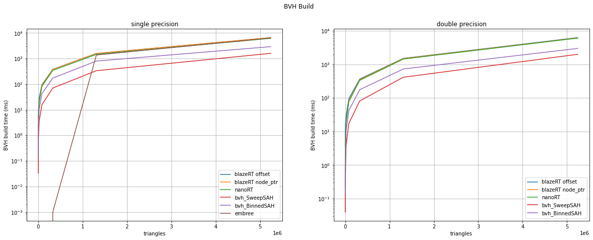

[](https://travis-ci.com/cstatz/blazert)

# blazeRT

1. [Introduction](#introduction)
    1. [Contributing](#contributing)
    2. [Versions](#versions)
2. [Features](#features)
3. [Installation](#installation)
    1. [Dependencies](#dependencies)
    2. [Clone the repository](#clone-the-repository)
    3. [Build and Test](#build-and-test)
    4. [Configuration](#configuration)
4. [Usage](#usage)
    1. [Examples](#examples)
    2. [Minimal Examples](#minimal-example)
    3. [Notes](#notes)
5. [Benchmarks](#benchmarks)
6. [License](#license)


## Introduction
blazeRT is a **double precision ray tracer** for scientific or engineering applications derived from 
[nanoRT](https://github.com/lighttransport/nanort) using blaze datatypes and written in modern C++17. 
blazeRTs scene interface is similar to [embree](https://github.com/embree/embree) and intents to be a minimal 
effort (nearly plugin-) replacement. blazeRT should work on any system and architecture for which a recent 
(C++17 compatible) compiler is available.

We aim at providing a **simple and unambiguous high-level API** for the ray-traversal.
We do not aim at providing backwards-compatibility (especially to older C++ standards).

blazeRT makes use of the the [blaze](https://bitbucket.org/blaze-lib/blaze/src/master/) linear algebra
library for its vector types. Because we rely on a well-tested and well-optimized linear algebra library
(instead of using our own vector types), blazeRT can focus on the actual ray tracing algorithms. Furthermore,
using types from a linear algebra library is advantageous for the subsequent development of scientific application 
where the vector types are needed again. blazeRT should work with any library providing these vector types as 
long as certain criteria are met (a minimal set of operation on these vector types).

blazeRT works with triangular meshes and simple primitives, but it is easy to extend blazeRT 
to work on polygons or more complex primitives. A template for user-defined geometries can be found 
[here](examples/geometry_template/GEOM_TEMPLATE.h). If you implement new geometries, we are more than happy to receive
a pull request from you to include it in blazeRT.

blazeRT is tested using unit tests (whose number will increase as development progresses). We try to ensure high code 
quality and a reproducible build experience via continuous integration. During the CI process we 
build the examples and the test cases, which need to run successfully in order for the CI to pass. Currently, 
blazeRT is CI-tested on Ubuntu 18.04 and macOS with gcc and clang.


(Rendered using the `path_tracer` example adapted from `nanoRT` and originally contributed by 
[daseyb](https://github.com/daseyb))

### Contributing
We appreciate all contributions from issues to pull requests. 

For contributing, please read the [contribution guide](CONTRIBUTING.md).

### Versions
The releases are based on the master branch. The release-version is tagged and follows the scheme Year.Quarter.Revision.

## Features
- [x] modern C++
- [x] single and double precision ray tracing 
- [x] simple and unambiguous high-level scene-based API
- [x] [Embree](https://github.com/embree/embree) fall back for single precision floats
- [x] using vector and matrix type from [blaze](https://bitbucket.org/blaze-lib/blaze/src/master/) for efficient 
linear algebra
- [x] currently supported geometry
    - [x] triangular meshes
    - [x] spheres
    - [x] (finite) planes
    - [x] cylinders
- [x] BVH accelerated ray racing
- [ ] back-face culling (will be implemented)
- [x] unit tests via [doctest](https://github.com/onqtam/doctest)
- [x] documentation of the test cases in ```test/doc```
- [x] benchmark (comparing [embree](https://github.com/embree/embree), [nanoRT](https://github.com/lighttransport/nanort), [madmann91/bvh](https://github.com/madmann91/bvh) and blazeRT) via [google benchmark](https://github.com/google/benchmark)
- [x] cmake script to aggregate the code into a single-header library (not recommended)

## Installation
Installation and build are tested on linux (e.g. ubuntu bionic, arch linux) and macOS.
Before starting the build process please ensure all dependencies are properly installed and available to the project.

### Dependencies
 * C++17 capable compiler
 * cmake (>= 3.11.0)
 * [blaze](https://bitbucket.org/blaze-lib/blaze/src/master/) (>= 3.7)
 * [Embree](https://github.com/embree/embree) (>= 3) if ```EMBREE_TRACING``` fallback is desired 
 * [doctest](https://github.com/onqtam/doctest) (for testing, pulled in as submodule)
 * [google benchmark](https://github.com/google/benchmark) (for running the benchmarks)

### Clone the repository

Clone the repository with the following command:
```git clone https://github.com/cstatz/blazert.git```

For the tests and the benchmarks the submodules must be cloned as well:
```
git submodule init
git submodule update 
```
This will pull doctest, [nanoRT](https://github.com/lighttransport/nanort) and [madmann91/bvh](https://github.com/madmann91/bvh) as submodules.

### Build and test
This is a header-only library. No need to build anything. Just drop it in your source directory and off you go.
The build step is solely for the examples, tests and the benchmark.

We strictly recommend an out-of-source build in a separate directory (here for simplicity ```build```) 
Starting in the source directory to project is build from the commandline as follows:
```shell script
mkdir build
cd build 
ccmake ../  # create cache and configuration
cmake --build .
cmake --build . -- install  # If package needs to be installed 
ctest  # Runs the tests
```

**For maximum performance**, we recommend building with **gcc** which results in a 15% to 20% better performance
compared to clang (on linux and macOS). The provided benchmarks might be used to tune the compilation flags for your 
specific system and architecture.

**A word of caution:** blazeRT will compile and work with compiler optimizations enabled (up to **-O3**), but needs 
infinite-math. If your application needs fast-math, ensure that the blazeRT code path is compiled with 
`-fno-finite-math-only` (in case of clang). In terms of performance, in its current form there is no major runtime 
difference between compilation with *-O2* and *-O3*. 

### Configuration
The easiest way to set the configuration variables is by using ```ccmake``` or pass the variables
via ```cmake ../ -D<VARIABLE>:<TYPE>=value```.

- ```ENABLE_OMP```: Enable OpenMP in examples (for traversal)
- ```BUILD_TEST```: Build tests
- ```BUILD_BENCHMARK```: Build the benchmarks
- ```BUILD_EXAMPLES```: Build examples
- ```EMBREE_BACKEND```: Use [Embree](https://github.com/embree/embree) as single-precision floating point tracing 
backend
- ```BLAZE_INCLUDE_OVERRIDE```: Where to find the blaze includes. Must set on windows for 
[blaze](https://bitbucket.org/blaze-lib/blaze/src/master/) <= 3.7

## Usage
To get familiar with the usage of blazeRT, look at the provided examples and test cases. To get started quickly,
checkout the minimal examples below.

- The [scene](blazert/scene.h) API can be considered **stable**, while the low-level API of the [BVH](blazert/bvh) 
(```build```, ```traverse```, ...) are not to be considered stable as they might change when requirements 
change with time.

- To control the maximum tree depth set the ```BLAZERT_MAX_TREE_DEPTH``` to a sensible value
before including ```blazert/blazert.h```. Default value is 28 which corresponds to max. 134 million
leafs in the BVH (for a well-balanced tree).

- If single-precision floating-point ray tracing with [Embree](https://github.com/embree/embree) is desired
define ```EMBREE_TRACING``` before including ```blazert/blazert.h```. When tracing using the embree backend, vector types 
with an alignment of 16 bytes are needed (you have to ensure this yourself).

Either prim-references, -indices or primitives are stored in the bvh-nodes. Which case is 
implemented depends on the prim-collection.

### Examples
- [x] [path tracer with randomly distributed rays](examples/path_tracer) for meshed geometries with rendered output
- [x] [deterministic path tracer for reproducibility](examples/renderer) for meshed geometries
- [x] [path tracer based on the scene facility](examples/scene_mesh) of blazeRT without rendered output 
(define ```EMBREE_TRACING``` for usage of embree fallback)
- [x] [cylinder and sphere primitives](examples/scene_primitives) within a blazeRT scene and color-coded output

### Minimal Example
Example for using blazeRT can be found the the `examples` subdirectory.

To give you an impression of the High-Level API
(adapted from ```examples/scene_primitives```):
```
// snip 8<
  
  /// Create the scene and add some primitive collections:
  blazert::Scene<ft> scene;
  scene.add_cylinders(*centers, *semi_axes_a, *semi_axes_b, *heights, *rotations);
  ///scene.add_spheres( ... );
  ///scene.add_triangles( ... );
  
  /// Commit and build the scene
  scene.commit();
  
  /// Iterate of the ray directions:
  for (int y = 0; y < height; y++) {
    for (int x = 0; x < width; x++) {

      const blazert::Ray<ft> ray{{0.0, 5.0, 20.0}, 
      		                    {static_cast<ft>((x / ft(width)) - 0.5),
                                 static_cast<ft>((y / ft(height)) - 0.5), 
                                 static_cast<ft>(-1.)}};
      blazert::RayHit<ft> rayhit;
      
      if (intersect1(scene, ray, rayhit)) { 
        /// Do something useful ...
      }
    }
  }

// >8 snip
```

### Notes
- Different from nanoRT, the bvh-build is not (yet) parallelized. For meshes with 5 million triangles, blazeRT
needs about 5 seconds to build the BHV and about 20 seconds for 20 million triangles. For scientific or engineering ray 
tracing applications the scene is usually static while ray origin and direction are varied. The computational effort is
 hence defined by the traversal and not the build.
- ```BLAZERTALIGN``` is currently not used but might be used in the future. 

## Benchmarks
We have included benchmarks comparing blazeRT to [nanoRT](https://github.com/lighttransport/nanort),
[embree](https://github.com/embree/embree) and [madmann91/bvh](https://github.com/madmann91/bvh) for bvh build and 
traversal. The benchmark scene is a (triangle-) meshed sphere which which can be refined by sub-division. There are 
two traversal cases: 
- A rendering case where the scene size (number of triangles) is increased (while maintaining the same dimensions) and 
8192 * 8192 rays are shot at the scene in a rectangular pattern.
- A scientific case where the scene size as well as the number of rays are increased (a ray is shot at each vertex of 
the sphere mesh). This can be considered as some kind of worst cast, because every ray hits and for each ray multiple 
overlapping bounding boxes (and subsequent primitives) need to be tested.

The benchmarks are run for the most recent (git-) revisions of the compared ray tracing libraries.

*Please take the results with a grain of salt. The measured timings heavily depend on the chosen compiler, compiler version, level of optimization, operating system, system architecture, and the way the system is used otherwise (e.g. do multiple users have concurrent access to the system). We cannot guarantee that the optimal configuration (or even api) is chosen for all benchmarked libraries. Regarding embree: we're comparing traversal or intersection routines that are similar in behaviour. That means, for embree the benchmarks are performes with single ray traversal (rtcIntersect1). This is not optimal and embree is way more powerful (leveraging all the vectorization goodness) using the streaming api (or calls to rtcIntersectN).*

The provided results were obtained using the following configuration:
- OS: linux
- Kernel: linux-5.6.15
- CPU: Intel i5-8250U (8) @ 3.400GHz
- RAM 32 GB
- L1-Cache: 32 KB 
- L2-Cache: 256 KB
- L3-Cache: 6144 KB
- compiler: g++-10
- optimization flags as documented in the projects root CMakeLists.txt
- OpenMP disabled for build and traversal

The following plots show the benchmark results for the bvh build and the traversal for a realistic rendering
case (not all rays hit) and for a realistic scientific rendering case (all rays hit).

 
 
 

## License

blazeRT is licensed under the new **BSD (3-clause) license**.
blazeRT is based on and inspired by `nanoRT.h` which is licensed under MIT-License. For comparability, nanoRTs 
`path_tracer` and madman91/bvhs `benchmark` have been adapted to blazeRT to generate a baseline for the tests 
and benchmarks.

*We decided to not extend nanoRT due to the intrusive nature of the changes that came with the introduction of the blaze
 datatypes. Another reason was the possibility for an enhanced maintainability if the code is not kept (and developed) 
 in a single-header library.*

The examples are built around third-party libraries (e.g. `tiny_obj_loader` and `stb_image_write`) 
which adhere to their own respective licenses (found in the included files).

The rendering examples are taken from the `nanoRT` and `bvh` repos and serve as a baseline. 
The Lucy model included in the demo scene is taken from the Stanford 3D Scanning Repository: http://graphics.stanford.edu/data/3Dscanrep/
