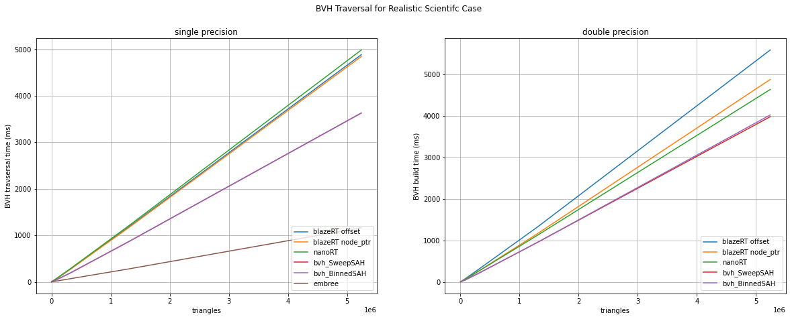

[](https://travis-ci.com/cstatz/blazert)

# blazeRT

1. [Introduction](#introduction)
    1. [Contributing](#contributing)
2. [Features](#features)
3. [Installation](#installation)
    1. [Dependencies](#dependencies)
    2. [Clone the repository](#clone-the-repository)
    3. [Build and Test](#build-and-test)
    4. [Configuration](#configuration)
4. [Usage](#usage)
    1. [Examples](#examples)
    2. [Minimal Examples](#minimal-example)
    3. [Notes](#notes)
5. [Benchmarks](#benchmarks)
6. [License](#license)


## Introduction
A **double precision ray tracer** for physics applications based on a [nanort](https://github.com/lighttransport/nanort) 
fork using blaze datatypes. blazeRTs scene interface is similar to [embree](https://github.com/embree/embree) and 
intents to be a minimal effort (nearly plugin-) replacement. 

 

blazeRT makes use of the the [blaze](https://bitbucket.org/blaze-lib/blaze/src/master/) linear algebra
library for its vector types. Because we rely on a well-tested and well-optimized linear algebra library
instead of using our own vector types, blazeRT can focus on the actual ray tracing algorithms. Furthermore
this is advantageous in subsequent scientific application where vector types are needed again. 

blazeRT works with triangular meshes and simple primitives, but it should be easy to extend blazeRT 
to work on polygons or more complex primitives.

blazeRT has unit test which will increase as development continues and we try to ensure code 
quality and a reproducible build experience via continuous integration. During the CI process we 
build the examples and the test cases, which need to run successfully for the CI to pass. Currently, 
blazeRT is CI-tested on Ubuntu 18.04 and macOS.

### Contributing
We appreciate all contributions from issues to pull requests. 

For contributing, please read the [contribution guide](CONTRIBUTING.md).

## Features
- [x] modern C++
- [x] using vector and matrix type from [blaze](https://bitbucket.org/blaze-lib/blaze/src/master/) for efficient 
linear algebra
- [x] single and double precision ray tracing 
- [x] [Embree](https://github.com/embree/embree) fall back for single precision floats
- [x] currently supported geometry
    - [x] triangular meshes
    - [x] spheres
    - [x] (finite) planes
    - [x] cylinders
- [x] BVH accelerated ray racing
- [x] unit tests via [doctest](https://github.com/onqtam/doctest)
- [x] documentation of the test cases in ```test/doc```
- [x] benchmark (comparing embree, nanort, bvh and blazeRT) via [google benchmark](https://github.com/google/benchmark)

## Installation
Installation and build is tested on linux (e.g. ubuntu bionic, arch linux) and macOS.
Before starting the build process please ensure all dependencies are properly installed and available to the project.

### Dependencies
 * c++17 capable compiler
 * cmake (>= 3.11.0)
 * [blaze](https://bitbucket.org/blaze-lib/blaze/src/master/) (>= 3.7)
 * [Embree](https://github.com/embree/embree) (>= 3) if ```EMBREE_TRACING``` fallback is desired 
 * [doctest](https://github.com/onqtam/doctest) (for testing, pulled in as submodule)
 * [google benchmark](https://github.com/google/benchmark) (for running the benchmarks)

### Clone the repository

Clone the repository with the following command:
```git clone https://github.com/cstatz/blazert.git```

For the tests and the benchmarks the submodules must be cloned as well:
```
git submodule init
git submodule update 
```
This will pull doctest, nanoRT and madmann91/bvh as submodules.

### Build and test
This is a header-only library. No need to build anything. Just drop it in your source directory and off you go.
The build step is for the examples.
We strictly recommend an out-of-source build in a separate directory (here for simplicity ```build```) 
Starting in the source directory to project is build from the commandline as follows:
```shell script
mkdir build
cd build 
ccmake ../  # create cache and configuration
cmake --build .
cmake --build . -- install  # If package needs to be installed 
ctest  # Runs the tests
```

**For maximum performance**, we recommend building with **gcc** which results in a 15% to 20% better performance
compared to clang. The provided benchmarks might be used to tune the compilation flags for your specific system.

**A word of caution:** blazeRT will compile and work with compiler optimizations enabled (up to **-O3**), but needs 
infinite-math. If your application needs fast-math, ensure that the blazeRT code path is compiled with 
`-fno-finite-math-only` (in case of clang). In terms of performance, in its current form there is no major runtime 
difference between compilation with *-O2* and *-O3*. 

### Configuration
The easiest way to set the configration variables is by using ```ccmake``` or pass the variables
via ```cmake ../ -D<VARIABLE>:<TYPE>=value```.

- ```ENABLE_OMP```: Enable OpenMP in examples (for traversal)
- ```BUILD_TEST```: Build tests
- ```BUILD_BENCHMARK```: Build the benchmarks
- ```BUILD_EXAMPLES```: Build examples
- ```EMBREE_BACKEND```: Use [Embree](https://github.com/embree/embree) as single-precision floating point tracing 
backend
- ```BLAZE_INCLUDE_OVERRIDE```: Where to find the blaze includes. Must set on windows for 
[blaze](https://bitbucket.org/blaze-lib/blaze/src/master/) <= 3.7

## Usage
To get familiar with the usage of blazeRT, look at the provided examples and test cases. To get started quickly,
checkout the minimal examples below.

- The [scene](blazert/scene.h) API can be considered **stable**, while the low-level API of the [BVH](blazert/BVH) 
(```build```, ```traverse```, ...) are not to be considered stable as they might change when requierements 
change with time.

- To control the maximum tree depth set the ```BLAZERT_MAX_TREE_DEPTH``` to a sensible value
before including ```blazert/blazert.h```. Default value is 28 which corresponds to ca. 134 million
leafs in the BVH.

- If single-precision floating-point ray tracing with [Embree](https://github.com/embree/embree) is desired
define ```EMBREE_TRACING``` before including ```blazert/blazert.h```. When tracing with embree vector types 
with an alignment of 16 bytes is needed.

Either prim-references, -indices or primitives are stored in the bvh-nodes. Which case is 
implemented depends on the prim-collection.

### Examples
- [x] [path tracer with randomly distributed rays](examples/path_tracer) for meshed geometries with rendered output
- [x] [deterministic path tracer for reproducibility](examples/renderer) for meshed geometries
- [x] [path tracer based on the scene facility](examples/scene_mesh) of blazeRT without rendered output
- [x] [cylinder and sphere primitives](examples/scene_primitives) within a blazeRT scene and color-coded output
- [ ] Embree fallback

### Minimal Example
Example for using blazeRT can be found the the `examples` subdirectory.

A minimal example would look like this:
```examples/scene_primitives``` to get a feeling for the API.
```c++
#include <blazert/blazert.h>
#include <memory>
#include <vector>

// This alias is defined in order to setup the simulation for float or double, depending on what you want to do.
using ft = double;

int main(int argc, char **argv) {

  int width = 8192;
  int height = 8192;

  // the properties of the cylinders need to be saved on the heap
  auto centers = std::make_unique<blazert::Vec3rList<ft>>();
  auto semi_axes_a = std::make_unique<std::vector<ft>>();
  auto semi_axes_b = std::make_unique<std::vector<ft>>();
  auto heights = std::make_unique<std::vector<ft>>();
  auto rotations = std::make_unique<blazert::Mat3rList<ft>>();

  blazert::Mat3r<ft> rot{
      {0, 0, 1},
      {0, 1, 0},
      {-1, 0, 0}};

  /***
   * Each cylinder adds an element to the std::vectors containing the corresponding parameters
   */
  // cylinder 1
  centers->emplace_back(blazert::Vec3r<ft>{-3, 3, 0});
  semi_axes_a->emplace_back(1);
  semi_axes_b->emplace_back(1);
  heights->emplace_back(1);
  rotations->push_back(rot);

  // cylinder 2
  centers->emplace_back(blazert::Vec3r<ft>{1, 4, 0});
  semi_axes_a->emplace_back(0.5);
  semi_axes_b->emplace_back(0.5);
  heights->emplace_back(2);
  rotations->push_back(rot);

  // Create the scene, add the cylinders and commit the scene
  // committing the scene builds the BVHs
  // After committing you cannot add anymore geometries
  blazert::Scene<ft> scene;
  scene.add_cylinders(*centers, *semi_axes_a, *semi_axes_b, *heights, *rotations);
  scene.commit();
  
  for (int y = 0; y < height; y++) {
    for (int x = 0; x < width; x++) {

      const blazert::Ray<ft> ray{{0.0, 5.0, 20.0}, 
      		                    {static_cast<ft>((x / ft(width)) - 0.5),
                                    static_cast<ft>((y / ft(height)) - 0.5), 
                                    static_cast<ft>(-1.)}};
      blazert::RayHit<ft> rayhit;

      const bool hit = intersect1(scene, ray, rayhit);
      if (hit) { 
        // Do something ...
      }
    }
  }

  return 0;
}
```
### Notes
- Compared to nanort the BVH accelerator is not built in parallel. For meshes with 5 million triangles, blazeRT
needs about 5 seconds to build the BHV and about 20 seconds for 20 million meshes. For scientific ray tracing 
applications the scene is usually static and the ray origin and direction are varied.
- ```BLAZERTALIGN``` is currently not used but might be used in the future. 
## Benchmarks
We have included benchmarks for blazeRT compared to [nanort](https://github.com/lighttransport/nanort),
[embree](https://github.com/embree/embree) and [madmann91/bvh](https://github.com/madmann91/bvh) for BVH build and 
traversal. The benchmark is a meshed sphere which is used as a triangular mesh geometry in all 
ray tracing kernels. 

The benchmarks are run for the most recent (git-) revisions of the compared raytracing libraries.


**NOTE**: For [madnamnn91/bvh](https://github.com/madmann91/bvh) we encoutered segfaults when running this on macOS for 
meshes that were bigger than a few hundred triangles. Therefore, take the results with a grain of salt.

The benchmarks were run on the following configuration:
- Kernel: linux-5.6.15
- CPU: Intel i5-8250U (8) @ 3.400GHz 
- RAM 32 GB
- L1-Cache: 32 KB 
- L2-Cache: 256 KB
- L3-Cache: 6144 KB

The following plots show the benchmarks results for the BVH build, the traversal of the BVH for a realistic rendering
case (not all rays hit) and for a realistic scientific rendering case (all rays hit).

 
 
 

## License

blazeRT is licensed under the new **BSD (3-clause) license**.
blazeRT is based on and inspired by `nanort.h` which is licensed under MIT-License.

The purpose of this fork is the simplified inclusion of the blaze-lib vector-types 
(or similar types that provided the necessary operators and datalayout) and an enhanced maintainability of the code.

The examples are built around third party libraries (e.g. `tiny_obj_loader` and `stb_image_write`) 
which adhere to their own respective licenses (found in the included files).

The rendering example is taken from the `nanort` repo and serves as a baseline. The Lucy model included 
in this demo scene is taken from the Stanford 3D Scanning Repository: http://graphics.stanford.edu/data/3Dscanrep/

